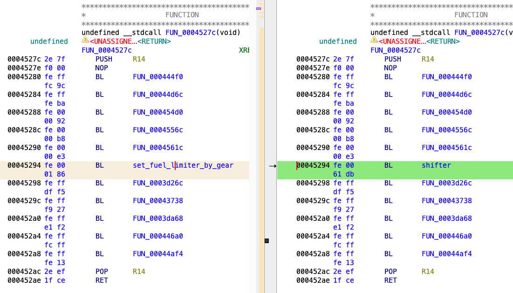
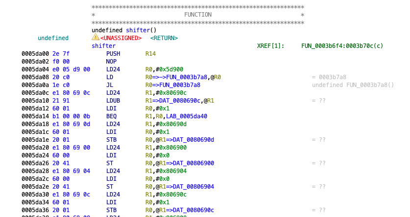

# Suzuki GSX-R ECU-based Quickshifter
## ... and how to write custom firmware for stock engine control units

A quickshifter module implemented in C for the 2007 Suzuki GSX-R 1000 K7 ECU (32920-21Hxx). This patch enables quickshifter functionality (clutchless shifting) in the stock ECU based on external sensor input.

## Safety Considerations

⚠️ **Important**: This patch modifies the original ECU (engine control unit) behavior. It is intended only for research and demonstrational purposes and shall not be used in road conditions. Absolutely NO guarantees of the safety or functionality of this patch are assumed.

- Always test in controlled environments
- Ensure proper and safe sensor hardware installation
- Verify signal connections before testing
- Keep backup of original ECU firmware

## Features

The patch is installed in the original ECU firmware. It monitors the quickshifter sensor input and activates when certain conditions are met:
- Signal is active (default: COV3 voltage < 0x10)
- Engine RPM above configurable threshold (default: 3000 RPM)
- Selected gear is below 6th
- Throttle position above minimum threshold

Upon activation, it briefly cuts fuel (70ms default) to unload the transmission and allowing the shift. The patch requires quickshifter sensor hardware (available commercially). By default, it assumes that the sensor signal is active low.

## How It Works

The COV3 pin (ECU connector pin 16) is used for the sensor input. This pin is wired to the SDS/diagnostic connector (blue/green wire) and is assigned to an ADC input channel that is not used for anything else during normal operation. In this reference implementation, the signal is active low, and on idle, the pin is pulled up to 5V with a 10k resistor. The SIGNAL_ACTIVE define is intended to be used for definining the active state of the sensor hardware.

## Configuration

Key parameters can be adjusted in `shifter.c`:

```c
const volatile unsigned short kill_time_ms = 70u;       // kill time for all gears
const volatile unsigned short cooldown_time_ms = 300u;  // minimum delay between shifts to avoid glitches
const volatile unsigned short min_shift_rpm = 0x1E00u;  // 3000 rpm in ECU units, i.e. scaled up by 2.56
const volatile unsigned char min_shift_tps = 0x0u;      // minimum TPS position to allow shifts
```

## Build Instructions

1. **Setup Environment**
    Install the M32R C/C++ Compiler Package. Set up the environment (assuming default location):
    ```bash
    source MakeEnv.sh
    ```

2. **Compile**
   ```bash
   make -f Shifter_Release.mak
   ```

3. **Create Patched Binary**

    Write the compiled file over the designated area of the original bin file.
    ```bash
    $ srec_info build/shifter.mot
    Format: Motorola S-Record
    Execution Start Address: 00000000
    Data:   05D900 - 05D908 # the const data is here
            05DA00 - 05DBCF # the "shifter" function is here
   $ srec_cat <original ecu file in> -Binary -offset 0x0 -exclude 0x5d900 0x5dbff build/shifter.mot -o <patched ecu file out> -Binary
   ```
   Patch the call to the original fuel limiter function to call our newly created function instead. In our case:
   ```bash
   printf '\xfe\x00\x61\xdb' | dd of=<patched ecu file from previous step> bs=1 seek=$((0x45294)) conv=notrunc
   ```
   In this case, the value **FE 00 61 DB** becomes the instruction for "Branch and link to 0x5DA00". The instruction sets the PC to PC + (imm << 2) = 0x45294 + (0x61db << 2) = 0x5DA00, which is the correct address.

   Now the call is correctly patched to point to our new functionality:

   

   The compiled shifter function residing in the ECU binary:

   

   Now you can load the binary on the ECU!

4. **Run unit tests (optional)**
    ```bash
    $ gcc test_shifter.c -o test_shifter && ./test_shifter
   ```
